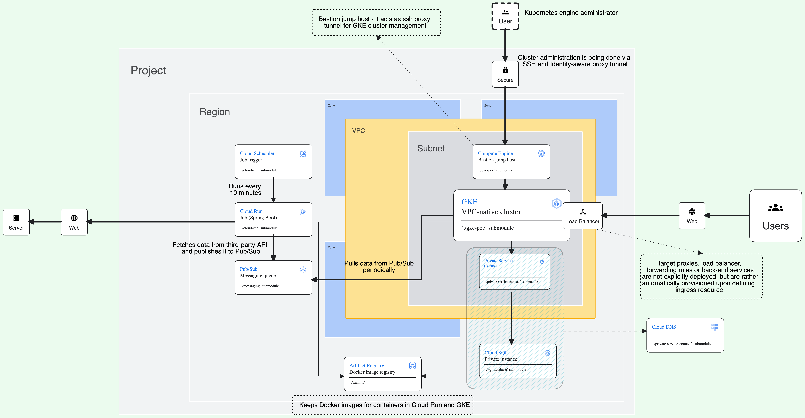

# Google Cloud Platform - Proof of concept

## Table of content

- [Overview](#overview)
- [Terraform - general notes](#terraform---general-notes)
- [Google Kubernetes Engine](#google-kubernetes-engine)
- [Cloud SQL](#cloud-sql)
- [Cloud Run](#cloud-run)
- [Pub/Sub](#pubsub)
- [How to run](#how-to-run)

### Overview

This is a project that explores some common GCP features. The infrastructure provided here is far from production-grade,  
but the concepts used to get everything to work are the latest 'de facto' standard and Google-recommended.

<figure>
   
   <figcaption>
      Full-sized image is 'gcp-poc-architecture.png'
   </figcaption>
</figure>

If you prefer diagrams to text, opening up full-sized image from above will point you do the submodules you're interested in.

If you want to skip down to business you can go to [How to run](#how-to-run). Otherwise, let's analyse the image from above. 
Bellow are descriptions, module-by-module, with some (like IAM and Networking provisioning) being mentioned through-out
all the individual descriptions.

### Terraform - general notes

### Google Kubernetes Engine

At the center of this setup lies [VPC-native Kubernetes cluster](https://cloud.google.com/kubernetes-engine/docs/concepts/alias-ips) running two nodes (each being deployed to two separate zones)
with two pods running the same service (We'll address the service later). The service exposes the API to end-users. 
The nodes are private as well as the control plane's endpoint, thus administrating the cluster is done via
[Bastion jump host](https://cloud.google.com/solutions/connecting-securely#external) (SSH via Identity-aware proxy tunnelling). SSH proxying is configured by the startup script 
defined in the **gke-poc** submodule and for specific networking setup required for this to work, look at the list below.

The resources for everything related to GKE:
- [GKE cluster and Bastion Jump host](https://github.com/levinine/gcp-poc-iaac/tree/main/gke-poc)
- [Virtual Private Cloud and subnetwork](https://github.com/levinine/gcp-poc-iaac/tree/main/networking)
- [Specific setup for proxying through Bastion VM](https://github.com/levinine/gcp-poc-iaac/tree/main/networking/firewall-ingress-nat.tf)
- [Service accounts and role bindings](https://github.com/levinine/gcp-poc-iaac/tree/main/iam)

#### Terraform

Unlike with other resources, provisioning of Kubernetes cluster is done using 

### Cloud SQL

[MySQL is specific server doing the job](https://cloud.google.com/sql/docs/introduction). However, due to specific 
method of connection used to access the instance and database, 
[how to connect to Cloud SQL via Private Service Connect](https://cloud.google.com/sql/docs/mysql/configure-private-service-connect) 
would be a more useful resource.
The instance is running on Google-managed network and has no public or private ip. It is thus, only accessible through
its DNS.
User credentials, as well as database connection URL are passed to outside services (GKE) via 
[Secret Manager](https://cloud.google.com/secret-manager/docs/create-secret-quickstart)

Resources related to Cloud SQL:
- [MySQL instance, database and database user (used by services running in GKE)](https://github.com/levinine/gcp-poc-iaac/tree/main/sql-database)
- [Private Service Connect](https://github.com/levinine/gcp-poc-iaac/tree/main/private-service-connect)
- [Secret Manager](https://github.com/levinine/gcp-poc-iaac/tree/main/secret-manager)

### Cloud Run

[Cloud Run is a Google-managed, scalable compute platform](https://cloud.google.com/run/docs/overview/what-is-cloud-run).
In it, a small Spring boot application is deployed that picks up
data from a third-party API and publishes it on Pub/Sub, to be consumed by a service running in Kubernetes cluster.
The application is being run as a job (opposed to it being run as a service) and is being triggered to execute by a Cloud Scheduler.

Resources related to Cloud Run:
- [Cloud Run job and scheduler](https://github.com/levinine/gcp-poc-iaac/tree/main/cloud-run)
- [Service accounts and role bindings](https://github.com/levinine/gcp-poc-iaac/tree/main/iam)

### Pub/Sub

[Pub/Sub](https://cloud.google.com/pubsub/docs/overview) is used for as messaging service between Cloud Run and GKE, 
decoupling them. The application running in GKE is periodically pulling messages from the Pub/Sub topic. While push 
subscription would be more convenient and could demonstrate other, perhaps more real-world concepts and implementations,
it would also require an SSL/TLS certification which would go beyond the scope of this POC.

Resources related to Pub/Sub:
- [Pub/Sub topic and subscription](https://github.com/levinine/gcp-poc-iaac/tree/main/messaging)

## How to run

Before going any further here's a list of required permissions to fully provision and deploy  
this POC to work:

- Compute Instance Admin (v1)
- Compute Network Admin
- IAM Workload Identity Pool Admin
- IAP-secured Tunnel User
- Secret Manager Admin
- Service Account Admin
- Artifact Registry Administrator 
- DNS Administrator
- Project IAM Admin
- IAM Service Account Admin
- Pub/Sub Editor
- Cloud Run Admin
- Cloud Scheduler Admin 
- Cloud SQL Admin
- Secret Manager Admin
- Kubernetes Engine Admin

...and a list of GCP APIs to enable for this POC to work:

- Cloud Logging API
- Compute Engine API
- Cloud Monitoring API
- Kubernetes Engine API
- Cloud Run Admin API
- Cloud Pub/Sub API
- IAM Service Account Credentials API
- Security Token Service API
- Cloud DNS API
- Artifact Registry API
- Cloud Scheduler API
- Secret Manager API
- Identity and Access Management (IAM) API

> **Note:** The following instructions are being described for MacOS users. There should be little difference for 
> different OSs (Especially Ubuntu-like distros), but regardless - if you're not using MacOS, double-check commands
> before you execute them.

Login with **gcloud** and obtain **Application Default Credentials (ADC)**:
1. `gcloud auth login`
2. `gcloud auth application-default login`

When working with a team, it's recommended to keep state files remotely so all the team members reference the same state
when making changes. Storage bucket should be provisioned manually before initializing Terraform project locally.
After creating the storage bucket, it should be referenced as done in `./versions.tf:18-21`

Another resource that is generally recommended to have set up in advance is Docker image repository. Here, 
**Artifact Registry** is used, it's provisioned in one step as everything else, but its creation is properly sequenced 
if project is applied via `setup-tf.sh` script located in project root directory.

Before running the script, two more step - building and Dockerising applications for
[GKE](https://github.com/levinine/gcp-poc-gke-service) and [Cloud Run](https://github.com/levinine/gcp-poc-cloud-run-job).
The application for GKE is called ***weather-data*** and the one for Cloud Run ***weather-data-publisher***.

1. After cloning repositories, for each run:
   1. `./gradlew clean build`
   2. `docker build -f ./Dockerfile --tag=europe-west8-docker.pkg.dev/srb-du04-due-13/gcp-poc-artifact-registry/$(application_name):latest .`
2. [Authenticating local Docker to Artifact Registry](https://cloud.google.com/artifact-registry/docs/docker/authentication)

Running `terraform plan` in project root dir will preview which exact resources will be created and how are they set up.
Recommendation is to output the plan and, if it's correct, use it as the input for the `apply` command. The full process
should look like this:

1. `terraform plan -target=google_artifact_registry_repository.gcp-poc-artifact-registry -out=artifact-registry-plan`
   This will generate the *artifact-registry-plan* file. Use it to provision the Artifact Registry.
2. `terraform apply artifact-registry-plan`
   Running apply like this doesn't require explicit confirmation with typing 'yes', because it's presumed the plan is 
   already reviewed.
3. `docker push europe-west8-docker.pkg.dev/srb-du04-due-13/gcp-poc-artifact-registry/weather-data:latest`
4. `docker push europe-west8-docker.pkg.dev/srb-du04-due-13/gcp-poc-artifact-registry/weather-data-publisher:latest`
5. `terraform plan -out=gcp-poc-infra-plan`
6. `terraform apply gcp-poc-infra-plan`

Alternatively and as mentioned above, you could simply execute the `setup-tf.sh`. You will be prompted to confirm the plan
of provisioning twice, but everything else will run on its own.

Regardless, after Terraform had finished, the output will be printed in terminal which should be used to finalize the setup.
Run these commands in new terminal session.
Commands and order in which to execute them to achieve different goals:
1. To connect `kubectl` to remote cluster:
   1. `run-to-tunnel-to-bastion-via-iap`
   2. `run-to-specify-proxy`

   Test if tunneling works properly by running `kubectl get nodes`. You should get a list of two nodes in return.  

2. For GKE workloads to be able to use GCP services, the Kubernetes service account should be created and annotated to employ Workload identity:
   1. `kubectl create serviceaccount -n default pod-service-account-mapped`
   2. `kubectl annotate serviceaccount -n default pod-service-account-mapped iam.gke.io/gcp-service-account=pod-service-account-mapped@srb-du04-due-13.iam.gserviceaccount.com`  

3. To set up the ***Weather-data*** service, Kubernetes resources must be deployed; namely *deployment.yaml*, 
   *service-nodeport.yaml* and *ingress.yaml*, preferably in this order. All of these can be found in ***Weather-data***
   root directory:
   1. `kubectl apply -f $(resource_file)`  

4. To stop listening on remote client (stop SSH tunneling):
   1. `lsof -i -n -P | grep 8888 | awk '{print $2}' | grep -o '[0-9]\\+' | sort -u | xargs sudo kill`

If problem arises with connection, try opening up new terminal session, re-authenticating with gcloud and re-opening SSH
tunnel. Most of the time, this will resolve the issue. This also goes if you stop listening on the remote client and
wish to reconnect your local kubectl.

The remaining four outputs: *db-uri-id*, *db-username-id*, *db-password-id* and *pubsub-subscription-id* are references
to secrets in Secret Manager and are used in **application.properties** file in ***Weather-data*** application.